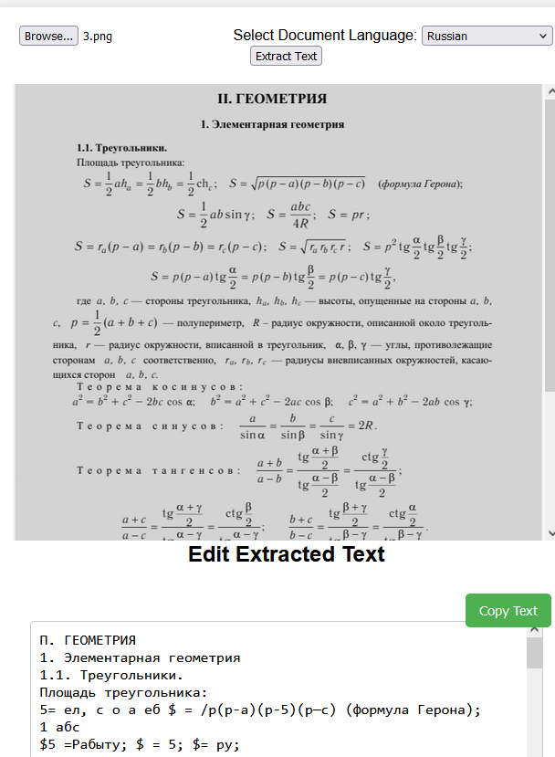

# Image OCR



## Overview

Try it out: [Image OCR Live Demo](https://ghauwan.github.io/image_ocr/)

Image OCR is a web application that allows users to upload an image containing mathematical symbols and extract the text from it using Optical Character Recognition (OCR). While it is primarily intended for math images, it can also be used to extract any other sort of text. The application supports multiple languages and provides an interface for users to edit and copy the extracted text. It can handle special mathematical symbols, allowing the extracted text to be edited and used according to your needs.

## Features

- Upload an image file.
- Select the document language for OCR.
- Crop the image section.
- Extract text from the uploaded/cropped image.
- Edit the extracted text in a text area.
- Copy the extracted text to the clipboard.

## Technologies Used

- HTML
- CSS
- JavaScript
- Tesseract.js (OCR library)
- Cropper.js (Image cropping library)

## Getting Started

To run the application locally, follow these steps:

1. Clone the repository:
   ```bash
   https://github.com/ghauwan/image_ocr.git
   cd math-symbols-extractor
